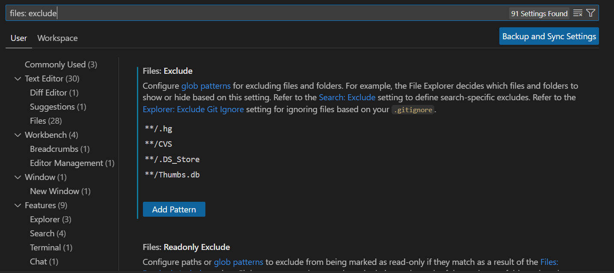

# GUI-03-Guía de uso de Git Hooks

## Propósito
Un Git Hook es un script que Git ejecuta automáticamente en ciertos puntos del ciclo de vida de los commits. Existen hooks que se ejecutan antes de realizar un commit, antes de hacer un push, después de un commit, y en otros eventos específicos.
Esta guía describe el procedimiento para instalar un git hook local en el repositorio con el objetivo de asegurar que los mensajes de commit cumplan con los estándares definidos en la organización. 

    :::info

    Esta guía fue creada para usuarios de Visual Studio Code. Si usas otro IDE, sigue los pasos usando la terminal o contáctate con Alex Shimano.

    :::


## Procedimiento

1. **Paso 1: Mostrar la carpeta .git**
    Si la carpeta `.git` no es visible en el explorador de archivos del repositorio al que agregarás el git hook, sigue estos pasos:
    - **Entrar a configuración**
      Abre la configuración de VS code (clic en el engranaje de abajo a la izquierda, settings).
    - **Entrar a exclude**
      En la barra buscadora escribe "files: exclude". Debería de aparecerte algo así:
        
    - **Quitar a .git de exclude**
      Elimina `.git` de la lista de exclusiones para que sea visible.

2. **Paso 2: Modificar el archivo commit-msg.sample**
    Dentro del directorio `.git/hooks`, abre el archivo `commit-msg.sample` y reemplaza su contenido con el siguiente script:
    ```sh
    #!/bin/sh
    # Get the commit message from the temporary file
    COMMIT_MSG_FILE="$1"
    FIRST_LINE=$(head -n 1 "$COMMIT_MSG_FILE")
    LINK_WIKI="https://pix3l-it.github.io/Wiki/docs/estandares/est-01-redactar-commits/"

    # Prefijos permitidos
    ALLOWED_PREFIXES=("feat" "fix" "refactor" "style" "docs" "chore" "test")

    # Por si es un commit vacío
    if [ -z "$FIRST_LINE" ]; then
      echo "ERROR: Tienes que escribir algo."
      echo "Para más información, visita $LINK_WIKI"
      exit 1
    fi

    # Checa que siga el formato
    VALID_PREFIX=false
    for prefix in "${ALLOWED_PREFIXES[@]}"; do
      if [[ "$FIRST_LINE" == "$prefix":* ]]; then
         VALID_PREFIX=true
         break
      fi
    done

    if ! $VALID_PREFIX; then
      echo "ERROR: El mensaje de commit debe de empezar con: "feat:", "fix:", "refactor:", "style:", "docs:", "chore:" o "test:"."
      echo "Para más información, visita $LINK_WIKI"
      exit 1
    fi

    # Por si termina con un punto
    if [[ "$FIRST_LINE" == *'.' ]]; then
      echo "ERROR: Commit no puede terminar con un punto."
      echo "Para más información, visita $LINK_WIKI"
      exit 1
    fi

    # Checa que el mensaje tenga menos de 50 caracteres
    if [ ${#FIRST_LINE} -ge 50 ]; then
      echo "ERROR: El mensaje de commit debe tener menos de 50 caracteres."
      echo "Para más información, visita $LINK_WIKI"
      exit 1
    fi

    # Checa que el mensaje esté en minúsculas
    if [ "$FIRST_LINE" != "$(echo "$FIRST_LINE" | tr '[:upper:]' '[:lower:]')" ]; then
      echo "ERROR: El mensaje de commit debe estar en minúsculas."
      echo "Para más información, visita $LINK_WIKI"
      exit 1
    fi

    exit 0
    ```

3. **Paso 3: Renombrar el archivo**
   Cambia el nombre del archivo de `commit-msg.sample` a `commit-msg` para que se ejecute al hacer commit.

Al hacer esto tendrás correctamente instalado el git hook para que todos tus commits sigan el estándar [EST-01](https://pix3l-it.github.io/Wiki/docs/estandares/est-01-redactar-commits/) del departamento, puedes hacer uno de prueba para verificar que funcione correctamente.

## Control de cambios

| Versión | Cambios realizados                               | Autor            | Fecha      |
| -------- | ---------------------------------------------- | ---------------- | ---------- |
| 1.0.0    | Creación de la guía de instalación del git hook | Alex Shimano    | 25/02/2025 |
| 1.0.1    | Inclusión de liga del estándar de commits | Jesús Cedillo    | 25/02/2025 |


